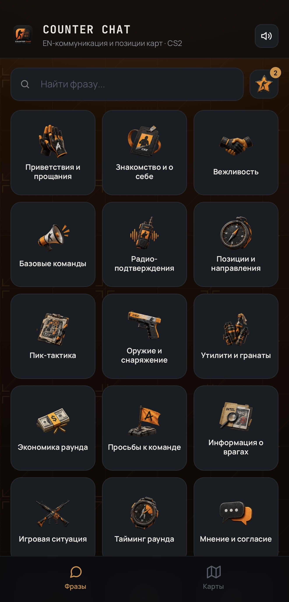
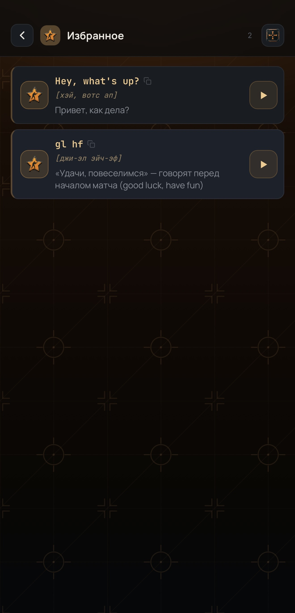
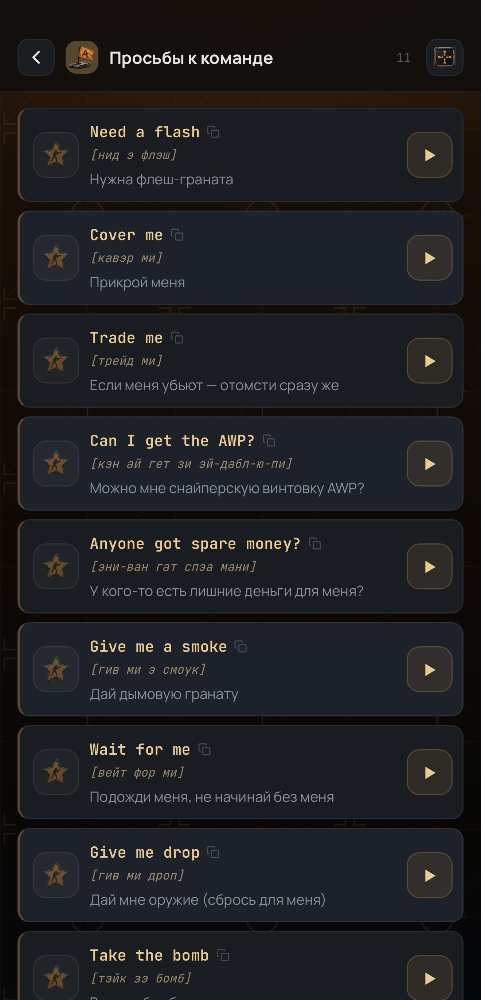
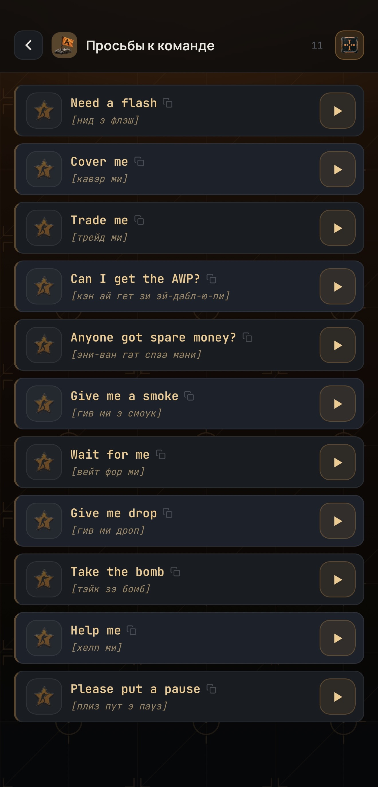
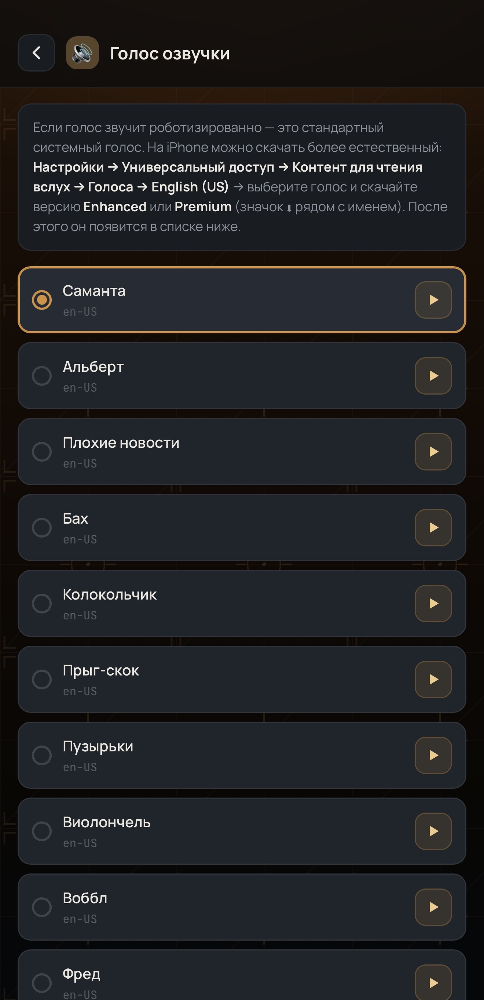
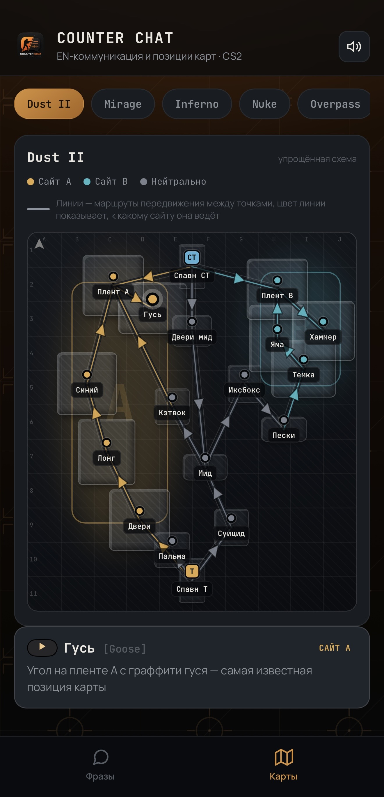

<div align="center">

# 🎯 COUNTER CHAT

### EN-разговорник и позиции карт для CS2

Быстрый доступ к английским игровым фразам с переводом, транскрипцией и озвучкой —
чтобы никогда больше не теряться в войсчате международного лобби.

<br/>


</div>

---

## О проекте

**Counter Chat** — это лёгкий веб-разговорник для игроков Counter-Strike 2, которые
играют в международных лобби, но не уверены в своём английском. Приложение решает
одну конкретную задачу: дать нужную фразу за один тап — с переводом, произношением
транскрипцией и озвучкой вслух, — не отвлекая от игры.

Работает как обычный сайт в браузере или как полноценное веб-приложение,
устанавливаемое на домашний экран телефона (PWA), в том числе полностью офлайн.

## ✨ Возможности

- 🗂️ **21 категория, 236+ фраз** — от приветствий и базовых команд до тайминга раунда,
  утилити, тильт-менеджмента и матчмейкинга
- 🔊 **Озвучка вслух** — синтез речи с выбором голоса из установленных на устройстве
  (с подсказками отдельно для iOS и Android, как получить максимально естественный голос)
- 🗺️ **Интерактивные карты** — 7 актуальных карт CS2 (Dust II, Mirage, Inferno, Nuke,
  Overpass, Ancient, Anubis) со стилизованной схемой позиций и колаутов
- ⭐ **Избранное** — сохраняй часто используемые фразы, они всегда под рукой
- 🕓 **История** — быстрый доступ к недавно скопированным фразам
- 📖 **Компактный режим** — переключатель плотности списка для быстрого сканирования
- 🔍 **Поиск** — мгновенный поиск по всем фразам сразу
- 📱 **PWA** — устанавливается на домашний экран iOS/Android, работает офлайн,
  свой сплэш-экран и иконка
- 🎨 **Тактический дизайн** — авторский UI в фирменной оранжево-чёрной палитре

<table align="center">
  <tr>
    <td></td>
    <td></td>
    <td></td>
    <td></td>
    <td></td>
    <td></td>
  </tr>
  <tr>
    <td align="center"><b>Главное меню</b></td>
    <td align="center"><b>Избранное</b></td>
    <td align="center"><b>Список фраз</b></td>
    <td align="center"><b>Компактный режим</b></td>
    <td align="center"><b>Голос озвучки</b></td>
    <td align="center"><b>Карты</b></td>
  </tr>
</table>


## 🚀 Быстрый старт

Проект — статический сайт без сборки и зависимостей. Всё, что нужно:

1. Либо открыть `index.html` в браузере — и всё уже работает.
2. Либо открыть `GitHubPages` https://petrovich-cs2.github.io/COUNTER-CHAT/


### Установка как приложение

**iOS:** открой сайт в Safari → «Поделиться» → «На экран «Домой»  
**Android:** открой сайт в Chrome → меню (⋮) → «Установить приложение»

После установки приложение запускается в полноэкранном режиме, со своей иконкой и
загрузочным экраном — как обычное нативное приложение.

## 🗂️ Структура репозитория

```
├── index.html          # всё приложение: HTML + CSS + JS в одном файле
├── manifest.json        # Web App Manifest (иконка/фуллскрин для Android)
├── icon-192.png          # иконка для манифеста (Android)
├── icon-512.png          # иконка для манифеста (Android)
├── splash-*.png          # загрузочные экраны под все актуальные размеры iPhone
└── README.md
```

## 🛠️ Технологии

Никакого фреймворка, никакой сборки — чистый **HTML / CSS / JavaScript**,
работающий в любом современном браузере. Все иконки и изображения встроены
как base64 прямо в разметку, поэтому приложение полностью самодостаточно и
работает без интернета после первой загрузки.

## 🙌 Автор (иконка кликабельна)

Сделано с любовью ♥️  

[](https://steamcommunity.com/id/ya-petrovich/)

Иконки и дизайн вдохновлены минималистичным стилем CS2.  
Все фразы собраны на основе реального игрового опыта и сообщества.

## 📄 Лицензия

**© 2026 Петрович. Все права защищены.**

Исходный код, дизайн и содержимое этого репозитория защищены авторским правом.
Копирование, изменение, распространение или использование в любой форме —
целиком или частично — без явного письменного разрешения автора запрещено.

---

<div align="center">
<sub>Не является официальным продуктом Valve.
<br>CS2 и Counter-Strike — товарные знаки Valve Corporation.</sub>
</div>
