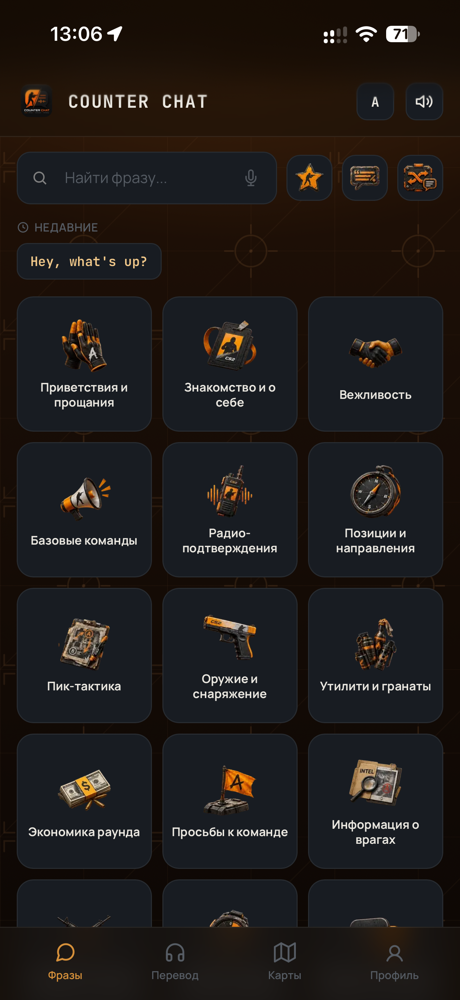
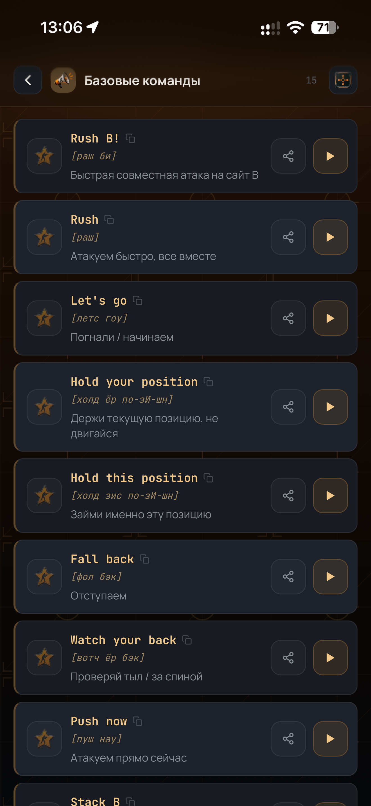
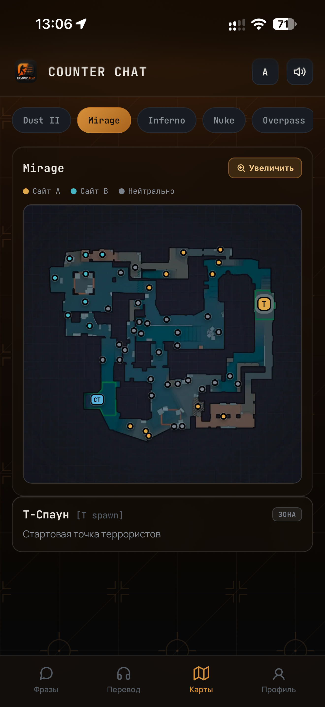
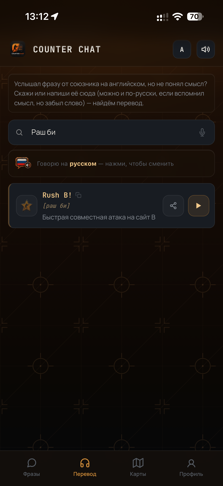
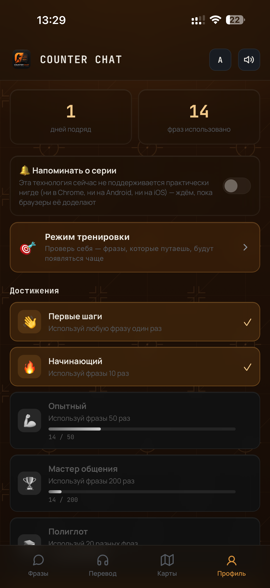
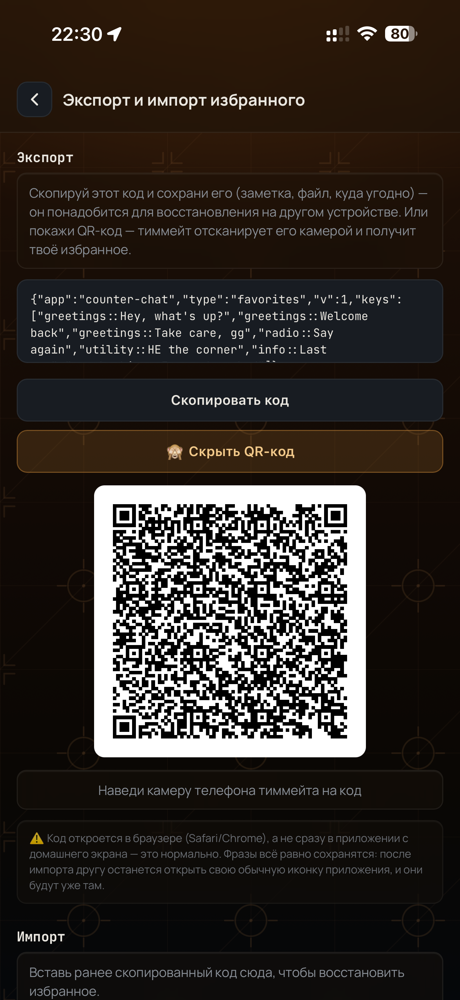
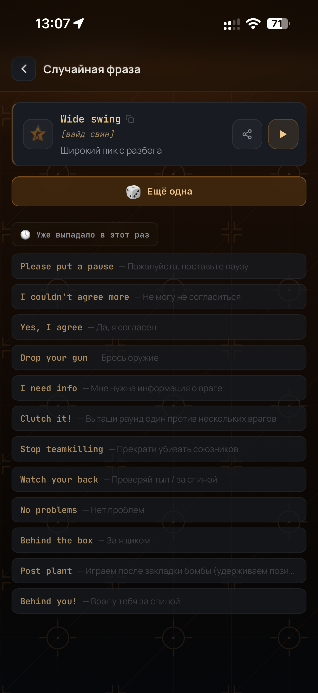
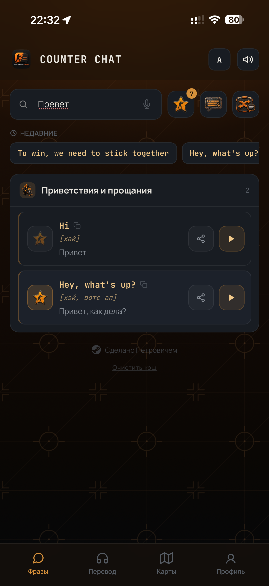
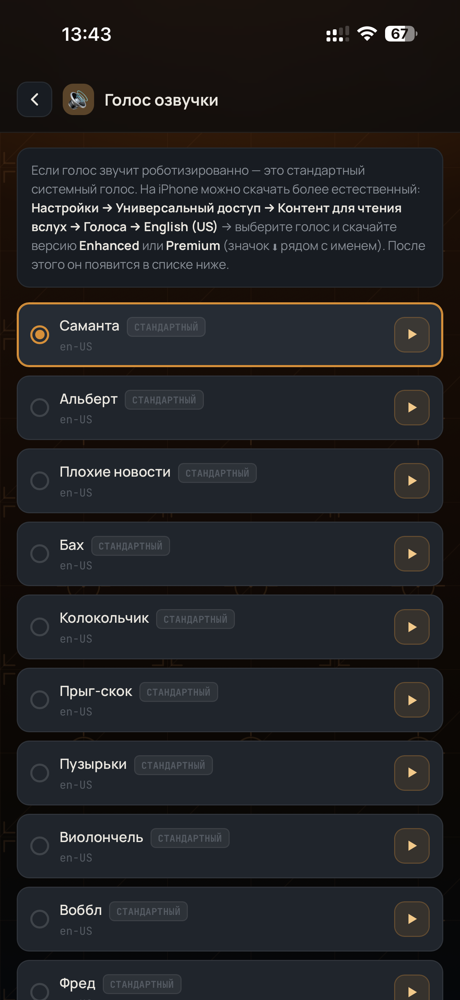

<div align="center">


Быстрый доступ к английским игровым фразам с переводом, транскрипцией и озвучкой —
чтобы никогда больше не теряться в войсчате международного лобби.


<br/>


</div>

---

## О проекте

**Counter Chat** — это лёгкий веб-разговорник для игроков Counter-Strike 2, которые
играют в международных лобби, но не уверены в своём английском. Приложение решает
одну конкретную задачу: дать нужную фразу за один тап — с переводом, произношением
транскрипцией и озвучкой вслух, — не отвлекая от игры.  

Работает как обычный сайт в браузере или как полноценное веб-приложение,
устанавливаемое на домашний экран телефона (PWA), в том числе по-настоящему
офлайн — через Service Worker с автоматическим обновлением в фоне.

## ✨ Возможности

•	👋 **Онбординг** — короткий экран знакомства с ключевыми функциями при первом запуске.   
• 🗂️ **21 категория, 236+ фраз** — от приветствий и базовых команд до тайминга раунда,
  утилити, тильт-менеджмента и матчмейкинга.  
 • 🔊 **Озвучка вслух** — синтез речи с выбором голоса из установленных на устройстве,
с честной пометкой «Сетевой» у голосов, которые могут звучать с задержкой (подсказки отдельно для iOS и Android, как получить более естественный голос).  
• 🔄 **Обратный словарь** — услышал фразу от союзника на английском, но не понял? Скажи
или напиши, что услышал (можно и по-русски) — отдельная вкладка с переключателем
языка голосового ввода EN/RU.  
•	🎤 **Голосовой поиск** — скажи фразу по-русски, приложение само найдёт совпадение и покажет английский эквивалент.   
• 🔍 **Текстовый поиск** — мгновенный поиск по всем фразам сразу.  
• 🎲 **Случайная фраза** — открой для себя фразу, которой ещё не пользовался: шанс
показать уже часто используемые фразы снижается автоматически; история показанного остаётся на экране за текущий заход.  
• ✍️ **Свои фразы** — добавляй собственные фразы (по одной или массово, списком), экспортируй/импортируй кодом или QR-кодом для передачи тиммейту.  
• 🗺️ **Интерактивные карты** — 7 актуальных карт CS2 (Dust II, Mirage, Inferno, Nuke,
  Overpass, Ancient, Anubis) со стилизованной схемой 120+ позиций и колаутов с аутентичными названиями CS-сообщества.  
• 🔎 **Зум карты** — полноэкранный просмотр схемы с масштабированием до 300% и прокруткой
для детального изучения позиций.  
• ⭐ **Избранное с экспортом/импортом** — сохраняй часто используемые фразы; переноси
список на другое устройство кодом или QR-кодом (данные «живут» в `localStorage`, поэтому без экспорта пропадут при смене телефона или очистке кэша).  
• 🏆 **Профиль и достижения** — счётчик дней подряд, 9 достижений с прогресс-барами,
топ-5 самых часто используемых фраз.  
• 📤 **Поделиться фразой** — отправляй фразу в любой мессенджер/по SMS через
системное меню «Поделиться» одним тапом.  
• 🕓 **История** — быстрый доступ к недавно скопированным фразам.  
• 📖 **Компактный режим** — переключатель плотности списка для быстрого сканирования.  
• 📱 **Полноценный PWA** — устанавливается на домашний экран iOS/Android, кастомная
кнопка установки, быстрые ярлыки с долгого тапа по иконке, индикатор офлайн-режима,
бейдж с числом избранного на иконке приложения, управление кэшем.  
• 🔃 **Умное автообновление** — новая версия подтягивается в фоне через Service Worker;
ненавязчивый баннер с кратким описанием изменений вместо тихой подмены на середине
использования.  
• 🎨 **Тактический дизайн** — авторский UI в фирменной оранжево-чёрной палитре,
с лёгким стеклянным эффектом (blur) на элементах интерфейса и подсказках.

<div align="center">

# 🖼️ Галерея

| <br>Главное меню | <br>Список фраз | <br>Карты |
| --- | --- | --- |
| <br>Обратный словарь | <br>Достижения | <br>QR-код экспорта |
| <br>Случайная фраза | <br>Поиск | <br>Онбординг |

</div>


## 🚀 Быстрый старт

Проект — статический сайт без сборки и зависимостей. Всё, что нужно:

1. Либо открыть `index.html` в браузере — и всё уже работает.
2. Либо открыть `GitHubPages` https://petrovich-cs2.github.io/COUNTER-CHAT/


### Установка как приложение

**iOS:** открой сайт в Safari → «Поделиться» → «На экран «Домой»  
**Android:** открой сайт в Chrome → меню (⋮) → «Установить приложение»

После установки приложение запускается в полноэкранном режиме, со своей иконкой и
загрузочным экраном — как обычное нативное приложение.

## 🗂️ Структура репозитория

```
├── index.html                   # всё приложение: HTML + CSS + JS в одном файле
├── sw.js                         # Service Worker — офлайн-доступ и автообновление
├── changelog.json                # краткое описание последнего обновления для баннера
├── manifest.json                 # Web App Manifest (иконка/фуллскрин/ярлыки для Android)
├── icon-192.png                  # иконка для манифеста (Android)
├── icon-512.png                  # иконка для манифеста (Android)
├── splash-*.png                  # загрузочные экраны под все актуальные размеры iPhone
├── robots.txt                    # разрешение индексации для поисковиков
├── sitemap.xml                   # карта сайта для поисковиков
├── .github/workflows/deploy.yml  # автосборка: версия и changelog подставляются при каждой публикации
├── LICENSE.md                    # все права защищены
└── README.md

```

## 🛠️ Технологии

Никакого фреймворка, никакой сборки — чистый **HTML / CSS / JavaScript**,
работающий в любом современном браузере. Все иконки и изображения встроены
как WebP/base64 прямо в разметку, поэтому приложение полностью самодостаточно и
работает без интернета после первой загрузки. QR-коды (для экспорта фраз)
генерируются собственным встроенным кодировщиком — без внешних библиотек.

Публикация на GitHub Pages автоматизирована через GitHub Actions: при каждом
пуше версия кэша и текст мини-changelog подставляются в `sw.js` автоматически,
без ручного редактирования.

## ⚠️ Известные ограничения платформы
Пара вещей, которые выглядят как баги, но на самом деле являются ограничениями
самих iOS/Android, а не нашего кода:  

•	**Статус-бар на iOS** — при запуске с домашнего экрана системный статус-бар
(время/заряд/вайфай) невозможно скрыть никаким способом через веб-технологии,
это осознанное ограничение Apple для веб-приложений.  

•	**Иконка в меню «Поделиться»** на iOS — если передать в navigator.share() одновременно title, text и url, с iOS 13.4 есть задокументированный баг Apple, из-за которого иконка превью пропадает (белая заглушка вместо неё) — подтверждено даже для нативных приложений на [официальном API](developer.apple.com/forums/thread/133575). Поэтому в коде url намеренно не передаётся. 

•	**Вибрация на iOS** — navigator.vibrate() не поддерживается в Safari ни в каком виде, включая PWA — Apple принципиально не даёт веб-страницам доступ к вибромотору. На Android ощущается, на iPhone просто тихо не срабатывает без ошибок. 

• **Кастомная кнопка установки и бейдж на иконке** — работают только на Chromium-браузерах (Android/десктоп). У iOS Safari нет события `beforeinstallprompt` и Badging API в принципе — это не наш недосмотр, а отсутствие соответствующих веб-стандартов в WebKit.

• **QR-код открывается в браузере, а не сразу в установленном приложении** — на iOS сканирование через системную камеру всегда открывает ссылку в Safari, даже если то же приложение уже стоит на домашнем экране. Данные при этом всё равно импортируются корректно (`localStorage` общий для браузера и standalone-режима на одном домене) — просто нужно будет вручную открыть свою иконку после.

## 🙌 Автор (иконка кликабельна)

Сделано с любовью ♥️  

[](https://steamcommunity.com/id/ya-petrovich/)

Иконки и дизайн вдохновлены минималистичным стилем CS2.  
Все фразы собраны на основе реального игрового опыта и сообщества.

## 📄 Лицензия

**© 2026 Петрович. Все права защищены.**
Полный текст — в [LICENSE.md](./LICENSE.md)

Исходный код, дизайн и содержимое этого репозитория защищены авторским правом.
Копирование, изменение, распространение или использование в любой форме —
целиком или частично — без явного письменного разрешения автора запрещено.

---

<div align="center">
<sub>Не является официальным продуктом Valve.
<br>CS2 и Counter-Strike — товарные знаки Valve Corporation.</sub>
</div>
